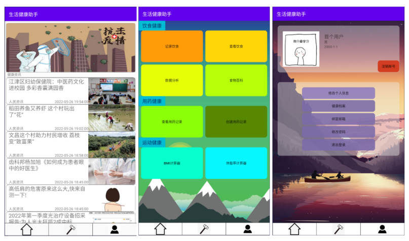
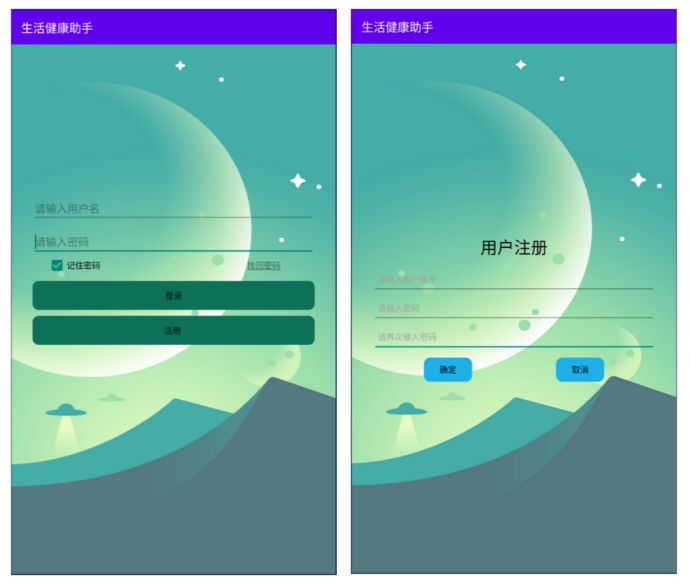
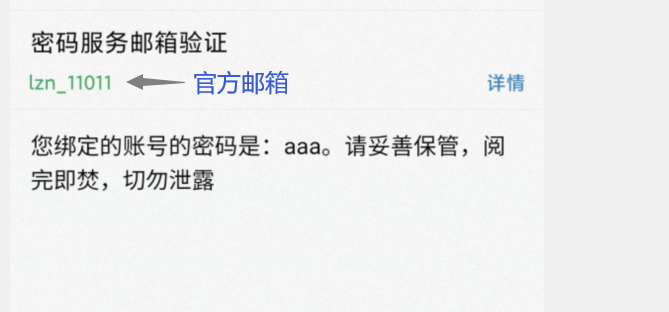
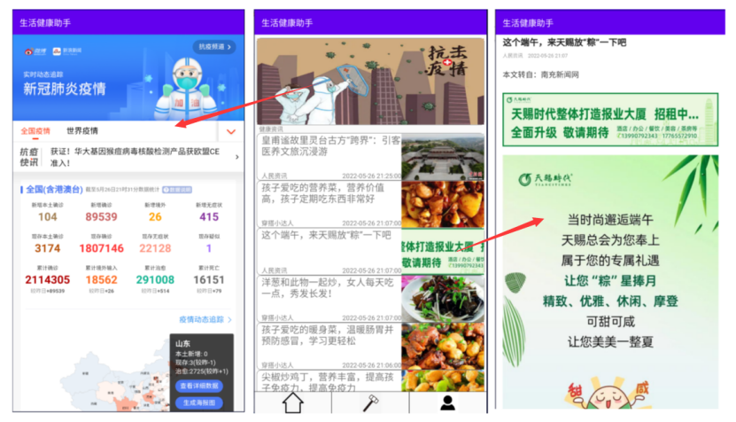
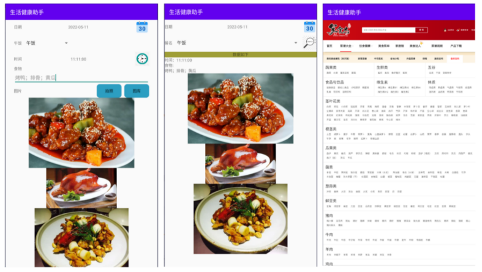
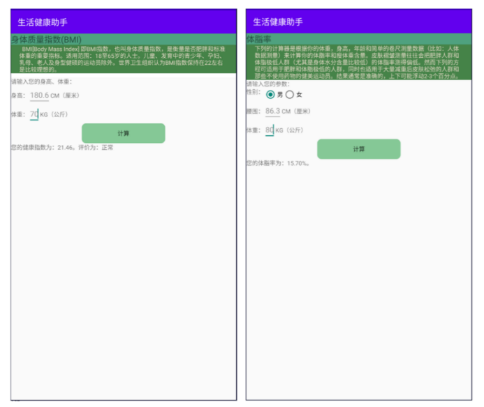
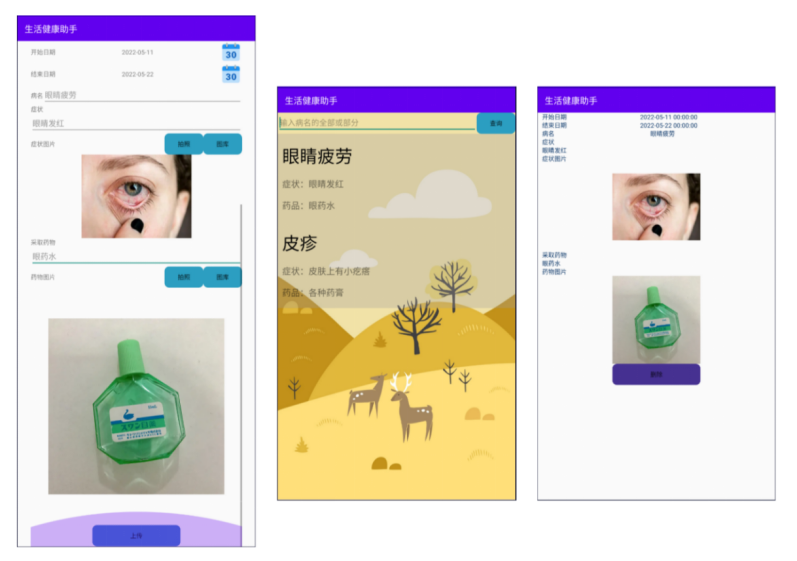
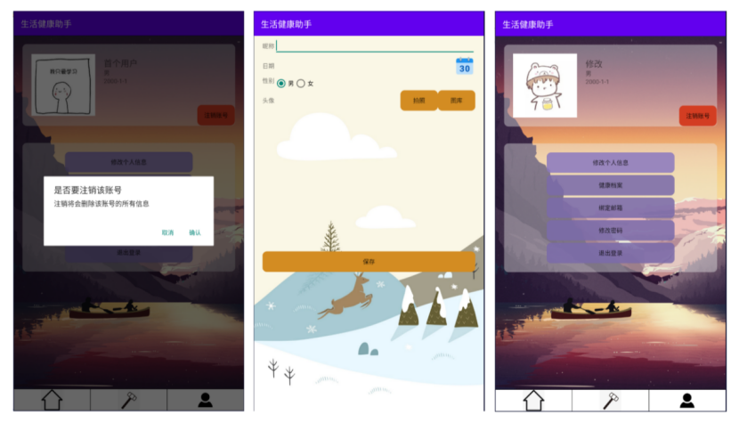
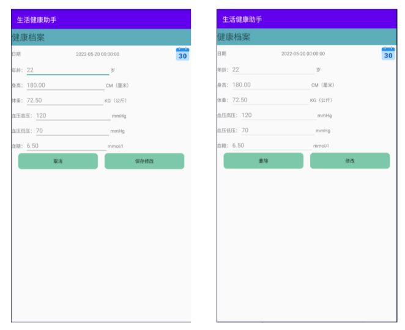
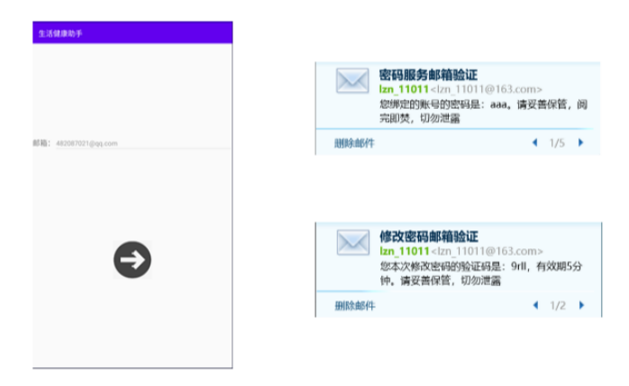

# lifehealthassistant_android

### 该系统是生活健康助手的客户端，也是用户界面
## GitHub地址：
### 服务器端(新项目，cloud版)地址为  https://github.com/genuinelv/lifehealthassistant_cloud
### 服务器端（老项目，boot版）地址为 https://github.com/genuinelv/lifehealthassistant_boot
### 客户端（本项目，Android）地址为  https://github.com/genuinelv/lifehealthassistant_android

## 相关配置
### Android studio版本：Android Studio Bumblebee | 2021.1.1 Canary 11
### gradle版本 7.2
### gradle插件版本7.1.1
### Java1.8
## 运行
### 更改com.example.lifehealthassistant.conifg下的ServerConfiguration中的IP，改成服务器的ip，我这里用的是cloud版本，其使用了网关gateway，端口号为10010
### 如果在输入账号密码后点击登录，程序发生崩溃，这时控制台输出“每日次数已达上限”，这代表着项目使用的免费新闻API接口使用次数已达上限。修改com/example/lifehealthassistant/service包下的NewsService文件，将其中GET注解的参数中的key换为文件中注释的其他key即可。
## 界面展示

